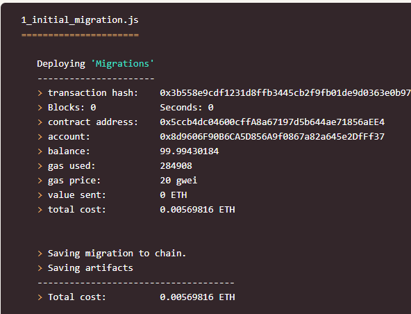

Group 1

KidEarn Allowance Project

With this project we wanted to build a dApp for parents and kids to use for chores and allowance. It gives parents an easy way to track chore completion in real time, and gives kids a platform to interact with  blockchain from an earlier age.

# Participants
Kelsey

Stephen

Ann

# Dependencies
* Truffle
* VS Code
* Excel2Json (used in Python)
* A working knowledge of solidity

# How it works

## Creating a list of Chores
To make chores easy to add/remove for adults, we used excel2json, which converts .xlsx files into JSON. You can then save the JSON file in your Migrations folder for use with the truffle box.

## Compiling

To compile your solidity contracts using truffle, simply cd into the directory where you stored the truffle box from your command line. Use command:
> truffle compile

## Migration

Truffle uses a migration system to handle smart contract deployments. The migration contract keeps track of changes. To migrate your contracts use command:
> truffle migrate

## Testing (optional)

Truffle has a command that allows you to test your solidity functions before deploying. Test by using the command:
> truffle test

## Deploying

The server will launch and automatically open a new browser tab containing your dapp. Use the command:
> npm run dev

## FrontEnd

The front end lists the chore, rate, age-range, and frequency of the chore, with a kid-friendly photo that illustrates the chore. 

When selecting a chore, the child clicks "Assign". The activity then reflects in transaction history. 

Once the chore is assigned - it reflects as by graying out the button and replacing with the term "Success."

KIDEARN tokens are then exchanged from Adult account to Child account for payment of the chore.

# Next Steps
1. To fully integrate token functionality into the front end.
2. To find a method to redeploy/reuse tasks without having to delete/re-add them to the JSON file.
3. Building in an interest feature for children that hold KIDEARN tokens long term.
4. Finding implementations for KIDEARN tokens - EX: linking to a kid-friendly account w/ debit card, or being able to exchange tokens for goods on websites.

# Photo Credits
All photos were taken from [Pexels](https://www.pexels.com/). Photo License[here]((https://www.pexels.com/license) ).

Images for Migrate1 and Migrate2 taken from [Truffle](https://www.trufflesuite.com/tutorials/pet-shop)